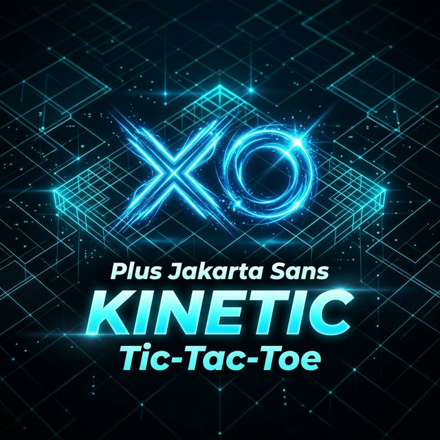

# KINETIC Tic-Tac-Toe



**KINETIC** is a premium, high-tech Tic-Tac-Toe experience built with Flutter. It features a sleek, futuristic design system ("Kinetic Precision") with dynamic theming, smooth animations, and a focus on visual excellence.

---

## 🎮 Features

- **Dynamic Theming Engine**: Support for multiple accent colors (Cyan, Purple, Solar, Acid) and seamless Dark/Light mode transitions.
- **Kinetic Precision UI**: A custom design system utilizing glassmorphism, vibrant gradients, and modern typography.
- **Advanced Game State**: Real-time score tracking, undo functionality, match timer, and intelligent win-line animations.
- **Global Settings**: 
  - Toggle Sound Effects and Haptic Feedback.
  - Profile Management (Name editing, Rank progress).
- **Match Results**: Detailed post-game analytics including time taken, moves count, and XP progression.

## 🛠 Tech Stack

- **Framework**: [Flutter](https://flutter.dev) (v3.4.0+)
- **State Management**: [Provider](https://pub.dev/packages/provider)
- **Navigation**: [GoRouter](https://pub.dev/packages/go_router)
- **Typography**: [Google Fonts (Plus Jakarta Sans)](https://fonts.google.com/specimen/Plus+Jakarta+Sans)
- **Design System**: Kinetic Precision (Custom Vanilla CSS inspired styling in Flutter)

## 🚀 Getting Started

### Prerequisites

- Flutter SDK
- Android Studio / VS Code with Flutter extension
- An emulator or physical device

### Installation

1. Clone the repository:
   ```bash
   git clone https://github.com/kal/Tik-Tac-Toe.git
   ```
2. Navigate to the project directory:
   ```bash
   cd Tik-Tac-Toe/kinetic
   ```
3. Install dependencies:
   ```bash
   flutter pub get
   ```
4. Run the app:
   ```bash
   flutter run
   ```

## 🎨 Design Philosophy

KINETIC is built on the philosophy of **"Living Interfaces"**. Every element responds to user interaction through micro-animations, depth effects, and dynamic color shifts. The use of HSL-tailored palettes ensures that every theme combination remains harmonious and visually striking.

---

Built with ❤️ by Kal and the Kinetic Team.
